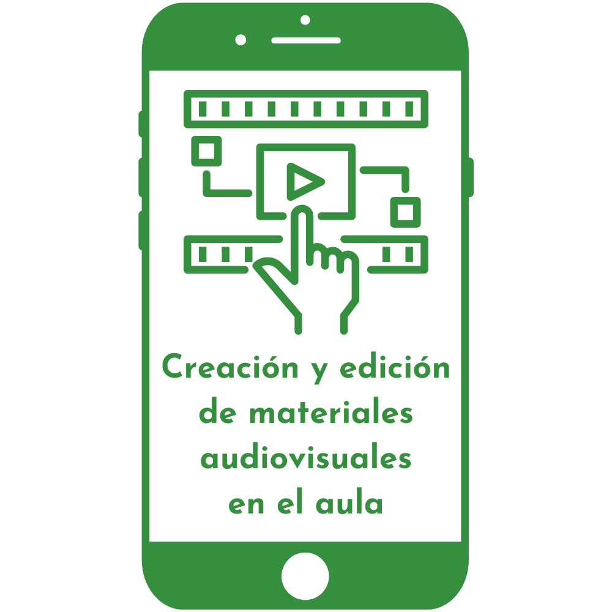

---

---
## Hands on CapCut

<small>capcut.com</small>

## ¿Qué es eso que se escucha?

Note:

- Agregar sonidos en Audio.
- Al seleccionar audio: volumen, desvanecer (fade in-out), dividir, velocidad y corte paralelo (genera puntos en función de melodía o ritmo).
- Texto a voz
---
## Tarea final

## Guías de ayuda

<small>https://davidlms.github.io/formacion-profesorado-edicion-video/guias/</small>
---
## Ticket de salida

<small>link wooclap</small>
---

<!-- .slide: data-background-video="../imagenes/video-edition.mp4" data-background-opacity="0.6" data-background-video-loop data-background-video-muted -->

## ¿Dudas?