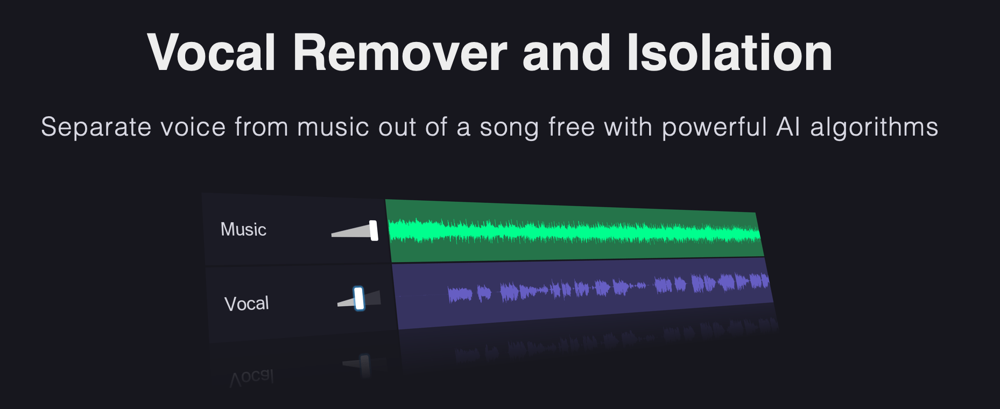

---
## ¡Planifica!

## ¿Qué significa planificar?

Guión <!-- .element: class="fragment" -->

Dispositivos y luces <!-- .element: class="fragment" -->

Materiales y objetos <!-- .element: class="fragment" -->

Las personas <!-- .element: class="fragment" -->
---
## 10 consejos para la fase de grabación

## 1. Conoce tu dispositivo

## 2. Programa la sesión

## 3. Siempre en horizontal

## 4. Estabiliza

## 5. Cierra los ojos

## 6. Ilumina adecuadamente

## 7. Recuerda enfocar

## 8. El encuadre perfecto

## 9. No te conformes con la primera

## 10. No olvides realizar una prueba técnica

---
## Edición básica de sonido

## Web edición sonido
---
## Hands on CapCut

<small>capcut.com</small>
---
## Herramientas que nos salvan la vida en la edición de audio

## Descarga de Youtube

<small>https://www.how2shout.com/url-online-video-downloader/</small>

## Limpia la voz

<small>https://vocalremover.org</small>

## Genera una voz

<small>https://fakeyou.com</small>

## Genera música con IA

<small>https://www.aiva.ai</small>

## Encuentra música generada con IA

<small>https://soundful.com</small>

## El futuro inmediato

<small>https://google-research.github.io/seanet/musiclm/examples/</small>
---
## Tarea final

¿Grabación?¿Se hace antes?

## Guías de ayuda

<small>https://davidlms.github.io/formacion-profesorado-edicion-video/guias/</small>
---
## Ticket de salida

<small>https://app.wooclap.com/FNRJUJ/questionnaires/63fd301b2f04b991a14023f7</small>
---

<!-- .slide: data-background-video="../imagenes/video-edition.mp4" data-background-opacity="0.6" data-background-video-loop data-background-video-muted -->

## ¿Dudas?