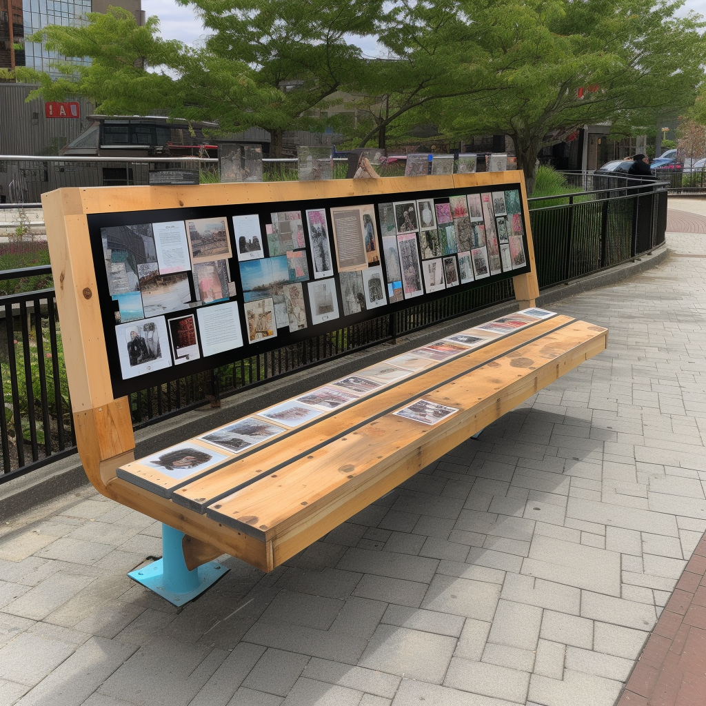

---
## ¿Cómo crees que puede usarse el vídeo en el aula?

## Algunas propuestas de uso del vídeo en el aula

Vídeos explicativos <!-- .element: class="fragment" -->

Retroalimentación <!-- .element: class="fragment" -->

Cortometrajes <!-- .element: class="fragment" -->

Difusión de actividades <!-- .element: class="fragment" -->

Promoción de proyectos

Grabación de eventos <!-- .element: class="fragment" -->

Vídeos interactivos <!-- .element: class="fragment" -->

Presentaciones y ensayos <!-- .element: class="fragment" -->

## La visualización del vídeo debe trabajarse

<small>https://es.wikipedia.org/wiki/Notas_Cornell</small>

## ¿Qué debo tener en cuenta para difundir un vídeo?

## Legalidad vigente

Referencia: Guía para centros educativos de la AEPD <!-- .element: class="fragment" -->

Siempre se puede grabar <!-- .element: class="fragment" -->

Se puede compartir de forma privada con implicados y progenitores <!-- .element: class="fragment" -->

No se puede difundir sin consentimiento explícito de esa grabación concreta <!-- .element: class="fragment" -->

## Retroalimentación de una actividad de edición de vídeo

<small>https://anno.so</small>

## ¿Qué opciones conoces para añadir interactividad a tus vídeos?

## 

Conjunto de herramientas libres para crear actividades interactivas

## Ventajas de H5P

Tu material, tu propiedad <!-- .element: class="fragment" -->

Nativas en Moodle y reutilizables <!-- .element: class="fragment" -->

Fácil de aprender y modulares <!-- .element: class="fragment" -->

Preparadas para el futuro <!-- .element: class="fragment" -->

---
## Hands on CapCut

<small>capcut.com</small>

## ¡No me pises!

Note:

- Superposiciones

## Ponte la máscara

Note:

- Máscara

## ¿Te has hecho algo?

Note:

- Filtros

## Me recuerda a ti

Note:

- Estilo (solo fotos, excepto los que pone vídeo)

## ¡Vaya efecto!

Note:

- Efectos
- Si se selecciona vídeo, aparece Retoque (no utilizar)

## Adiós fondo

## Algunos consejos sobre el uso del croma

No nos sirve cualquier color <!-- .element: class="fragment" -->

Siempre estirado <!-- .element: class="fragment" -->

Cuidado con las sombras <!-- .element: class="fragment" -->

Nunca es lo suficientemente grande <!-- .element: class="fragment" -->

Recuerda: ¡Prueba antes! <!-- .element: class="fragment" -->

## Algunos servicios para eliminar el fondo

[BgRem](https://bgrem.deelvin.com/es/)

[removebg](https://www.remove.bg/es)

[unscreen](https://www.unscreen.com)
---
## ¿Conoces bancos de recursos?

## Licencias Creative Commons

<small>[Fuente: articaonline.com](https://www.articaonline.com/2014/08/que-es-la-cultura-libre-tema-1-encirc)</small>

## Algunos bancos de imágenes

[Everypixel](https://www.everypixel.com/) → Busca en múltiples bancos de imágenes a la vez

[Pixabay](https://pixabay.com/)

[Unsplash](https://unsplash.com/)

[Reshot](https://www.reshot.com/)

[Life of pix](https://www.lifeofpix.com/)

## Algunos bancos de vídeos

[Pexels](https://www.pexels.com/es-es/)

[Life of vids](https://lifeofvids.com/)

[videvo](https://www.videvo.net/)

[Videezy](https://es.videezy.com/)

[coverr](https://coverr.co/)

[Mazwai](https://mazwai.com/)

## Algunos bancos de música

[Joystock](https://www.joystock.org/)

[mixkit](https://mixkit.co/free-stock-music/)

[Royalty Free Music](https://www.youtube.com/channel/UCQsBfyc5eOobgCzeY8bBzFg)

[Jamendo](https://www.jamendo.com/start)

[Uppbeat](https://uppbeat.io/)
---
## ¿Bienvenidos al futuro?

## Tecnologías llamadas a cambiarlo todo

XR (Realidad extendida) <!-- .element: class="fragment" -->

IA (Inteligencia Artificial) <!-- .element: class="fragment" -->

## XR - AR y VR

[Diciembre 2020](https://www.youtube.com/watch?v=jtYxJnvyqtg)

[Mayo 2021](https://www.youtube.com/watch?v=KhoyKABFvzA)

Sustituir por:

CamTrackAR (video de Mandalorian antes?)

https://www.flipsidexr.com

## Inteligencias Artificiales

## Expectativa

<small>[Fuente: waitbutwhy.com](https://waitbutwhy.com/2015/01/artificial-intelligence-revolution-1.html)</small>

## Realidad

<small>[Fuente: waitbutwhy.com](https://waitbutwhy.com/2015/01/artificial-intelligence-revolution-1.html)</small>

## Un ejemplo de aplicación
  
<video width="640" height="480" controls>
  <source src="imagenes/aplicacion-ia-video-dotcsv.mp4" type="video/mp4">
Tu navegador no soporta la etiqueta de reproducción de vídeos.
</video>

<small>[Fuente: @DotCSV](https://twitter.com/DotCSV/status/1520097583930224640)</small>

## ¿Qué podremos hacer pronto?

Imagina un vídeo...

[GPT-4](https://openai.com/product/gpt-4) genera el texto

[VALL-E](https://valle-demo.github.io) clona tu voz (y a varios idiomas gracias a [VALL-E X](https://vallex-demo.github.io))

[DeepStory](https://www.myheritage.es/deepstory) o [Synthesia.io](https://www.synthesia.io) da vida a tu avatar

[DALL-E](https://openai.com/product/dall-e-2)/[Stable Diffusion](https://stability.ai/blog/stable-diffusion-public-release)/[Midjourney](https://www.midjourney.com) genera las imágenes

[ControlNet](https://github.com/lllyasviel/ControlNet) modifica las imágenes

[Descript](https://www.descript.com) modifica tu discurso

## ¿Y las grabaciones? ¿Dónde queda el arte?

https://wonderdynamics.com
---
## Tarea final

Realización y solución de dudas de la tarea obligatoria del curso

## Guías de ayuda

<small>https://davidlms.github.io/formacion-profesorado-edicion-video/guias/</small>
---
## Sobre los materiales del curso

CC BY-SA <!-- .element: class="fragment" -->

Cultura libre <!-- .element: class="fragment" -->

Repositorio y página web <!-- .element: class="fragment" -->

## Descarga de los materiales
---
## Ticket de salida

<small>https://app.wooclap.com/FNRJUJ/questionnaires/63fd30199aa702bd94eefe88</small>
---

<!-- .slide: data-background-video="../imagenes/video-edition.mp4" data-background-opacity="0.6" data-background-video-loop data-background-video-muted -->

## ¿Dudas?